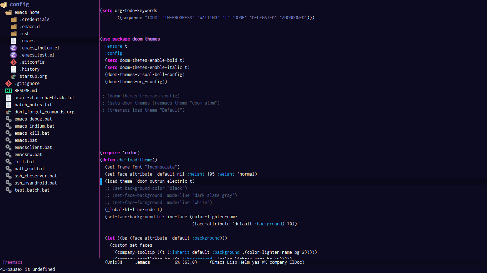

# dioveath Env Setup
Emacs for text editing and use CMD to execute certain tasks.

## Emacs
One of the best editor in scene. Uses lsp-mode with Emacs for Intellisense editing and 
treemacs for project structuring. 

## CMD
CMD commands sets up env variables in System. Have cmds to start emacs server and join as client. 
